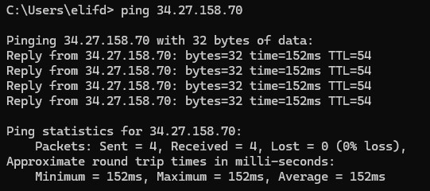
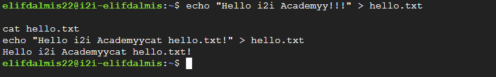

# i2i-Academy-IntroductionToCloud-1
# Objective

Create an account with Google Cloud Platform (GCP) or another Cloud Service Provider (like AWS) and set up a basic Virtual Machine (VM). Once the VM is up and running, perform the following operations to verify connectivity and basic Linux usage:

1. Ping Test
Perform a ping test from your local terminal/command prompt to the public IP address of your cloud VM to verify network connectivity.

2. SSH & File Creation
Connect to your VM via SSH. Once inside, create a text file (e.g., hello.txt) containing the text "Hello i2i Academy!" and read its content on the terminal.

